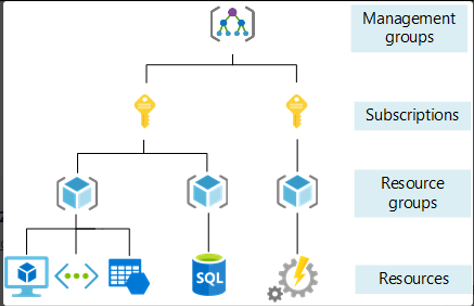
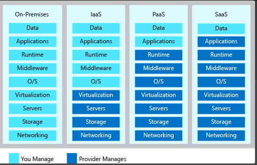
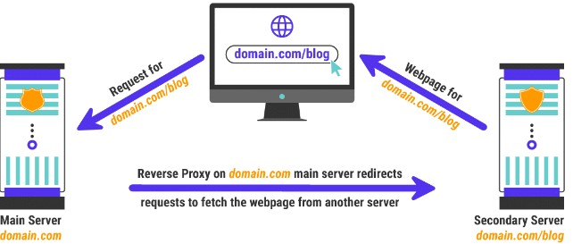
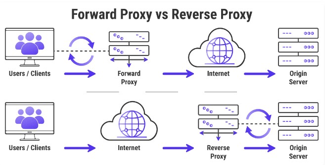

# Intro to Azure

### What is cloud?
It is services to store, process and manage data remotely. The services are available on demand. Has its own cooling (water supply), and power (generators that will keep tings running if it goes down). They usually are a certain distance between each other in case of a disaster.


<br />

### Creating VM

1. Creating SSH key

Generating the key

``` bash
iveta_6esu9b1@DESKTOP-GVT7GPM MINGW64 ~
$ mkdir .ssh

iveta_6esu9b1@DESKTOP-GVT7GPM MINGW64 ~
$ cd .ssh

iveta_6esu9b1@DESKTOP-GVT7GPM MINGW64 ~/.ssh
$ pwd
/c/Users/iveta_6esu9b1/.ssh

iveta_6esu9b1@DESKTOP-GVT7GPM MINGW64 ~/.ssh
$ ssh-keygen -t rsa -b 4096 -C "ivetaa1997@gmail.com"
Generating public/private rsa key pair.
Enter file in which to save the key (/c/Users/iveta_6esu9b1/.ssh/id_rsa): tech241-iveta-az-key
Enter passphrase (empty for no passphrase):
Enter same passphrase again:
Your identification has been saved in tech241-iveta-az-key
Your public key has been saved in tech241-iveta-az-key.pub
The key fingerprint is:
SHA256:y+bgzvWaXTjdZz/c4qKeXvL+sJKGHofPaXpHnikcc38 ivetaa1997@gmail.com
The key's randomart image is:
+---[RSA 4096]----+
|                 |
|                 |
|                 |
|                 |
|        S        |
|       . oooo.   |
|      . Bo=B=+o +|
|     o =.OOO*oo=E|
|     .+.*O@*++ooo|
+----[SHA256]-----+

iveta_6esu9b1@DESKTOP-GVT7GPM MINGW64 ~/.ssh
$ ls
tech241-iveta-az-key  tech241-iveta-az-key.pub
```

<br />


 Copying the key to use in our VM
 
 ```bash
iveta_6esu9b1@DESKTOP-GVT7GPM MINGW64 ~/.ssh
$ cat tech241-iveta-az-key.pub
ssh-rsa AAAAB3NzaC1yc2EAAAADAQABAAACAQDny2/VrYUZMAL54pVyTCFDSnA9GwOn0B46XlmFa+LNZP8SuKkTxzT/nyC9eO/cBU8qqeZdZm29T+3l4pUNxMNb9gCAl1BLOsMnHX60rdv1HENCBjsg+OW53NgAsQcMPIx4+Zo2NJ1mUouLzXMf0LF+2eGXlGg0pxXPElS0alBIa/P/4FBGwt/J9TL90A/VAf0fmnV9fC0z4Alc/PN2Ig3VXKUFnlbRHtcTITF+mp+fNEOwWw2y6fHOG93ipcbjXkuKJTkcVcWOYenI65av1zCqydUu7ydsVFdY5LhbphsC5y++U5m/3cAPkVD7jNlCZhdjujqIL1LnwwzKgOdGFFicSf/ez+001ktJqfvmx7jmcE0aNPQ== ivetaa1997@gmail.com

 ```

<br />

Making the key read only 

```bash
iveta_6esu9b1@DESKTOP-GVT7GPM MINGW64 ~/.ssh
$ chmod 400 tech241-iveta-az-key

iveta_6esu9b1@DESKTOP-GVT7GPM MINGW64 ~/.ssh
$ ls -l
total 8
-r--r--r-- 1 iveta_6esu9b1 197121 3389 Jun 20 15:47 tech241-iveta-az-key
-rw-r--r-- 1 iveta_6esu9b1 197121  746 Jun 20 15:47 tech241-iveta-az-key.pub

```

<br />

2. Logging into and out of VM

Logging in

```bash
iveta_6esu9b1@DESKTOP-GVT7GPM MINGW64 ~/.ssh
$ ssh -i ~/.ssh/tech241-iveta-az-key adminuser@20.58.17.46

```

Logging out

```PowerShell
exit
```


<br />

### 4 types of systems
1.	**Public cloud** (small business, multiple occupant cloud, typically how its used)
2.	**Private cloud** (cloud infrastructure dedicated to a company, a company has its own cloud structure). Private doesn’t have to be connected to the internet
3.	**Hybrid could**, a mix of on prem servers and public cloud
4.	**Multi cloud**, using different cloud providers 

<br />


### What is Azure?
Microsoft Azure, often referred to as Azure, is a cloud computing platform run by Microsoft, which offers access, management, and development of applications and services through global data centers

<br />


### Scope levels of Azure



**Management groups** – helps to manage access policies compliance for subscriptions. Set a policy on certain things you want. Set permissions. Way to separate billing for marketing team, testing team etc. only specific size of VM for group is located, good for cost. There can be management group within a management group.

**Subscriptions** – separate billing. Each subscription. Most popular – pay as you go. Limits for subscriptions, eg number of recourse groups (limits are usually quite high)

**Resource groups** – containers.  Can’t be resource group within a resource group. You must have it in Azure.

**Resources**

<br />


### Types of cloud services 



**IaaS** – infrastructure as a service

**PaaS** – platform as a service. (PaaS) is a complete cloud environment that includes everything developers need to build, run, and manage applications—from servers and operating systems to all the networking, storage, middleware, tools, and more.

**SaaS** – software as a service. Software as a service is a software licensing and delivery model in which software is licensed on a subscription basis and is centrally hosted. SaaS is also known as on-demand software, web-based software, or web-hosted software.
On-Premises - servers are on premises

<br />


### CapEx vs OpEx
Capital expenditure vs operational expenditure.

**Capital expenditure** – upfront costs (e.g equipment, if on prem you must buy servers. Mostly on prem, they still have some operational exp)

**Operational expenditures** – expenses are spread out throughout the year (the cloud)


### Connecting using scp

```
$ scp -i ~/.ssh/tech241-iveta-az-key -r C:/Users/iveta_6esu9b1/app adminuser@20.58.17.46:/home/adminuser/tech241-sparta-app
```

### Connecting using git clone

```
git clone https://linktogitrepo file-to-be-saved-in
```

<br />

### Reverse proxy

#### What is a port?

A port or port number is a number assigned to uniquely identify a connection endpoint and to direct data to a specific service. At the software level, within an operating system, a port is a logical construct that identifies a specific process or a type of network service.

<br />


#### What is reverse proxy?

A few definitions of proxy: 

A reverse proxy server is a type of proxy server that typically sits behind the firewall in a private network and directs client requests to the appropriate backend server. 

A reverse proxy is a type of proxy server that is used to protect a web server’s identity. It’s an intermediate connection point that forwards user/web browser requests to web servers, increasing performance, security, and reliability.


<br />

The difference between a forward proxy vs a reverse proxy is minor, but they work differently. The key difference between a reverse proxy and a forward proxy is that a forward proxy enables computers isolated on a private network to connect to the public internet, while a reverse proxy enables computers on the internet to access a private subnet.


<br />

#### Setting reverse proxy on nginx

1. Getting into nginx configuration file
```
nano /etc/nginx/sites-available/default
```
2. Change the try_files to apply the port we need
```json
location / {
    proxy-pass http://localhost: 3000;
}
```
3. Test the syntax
```
sudo nginx -t
```
4. Apply the edit to configuration file
```
restart nginx
```