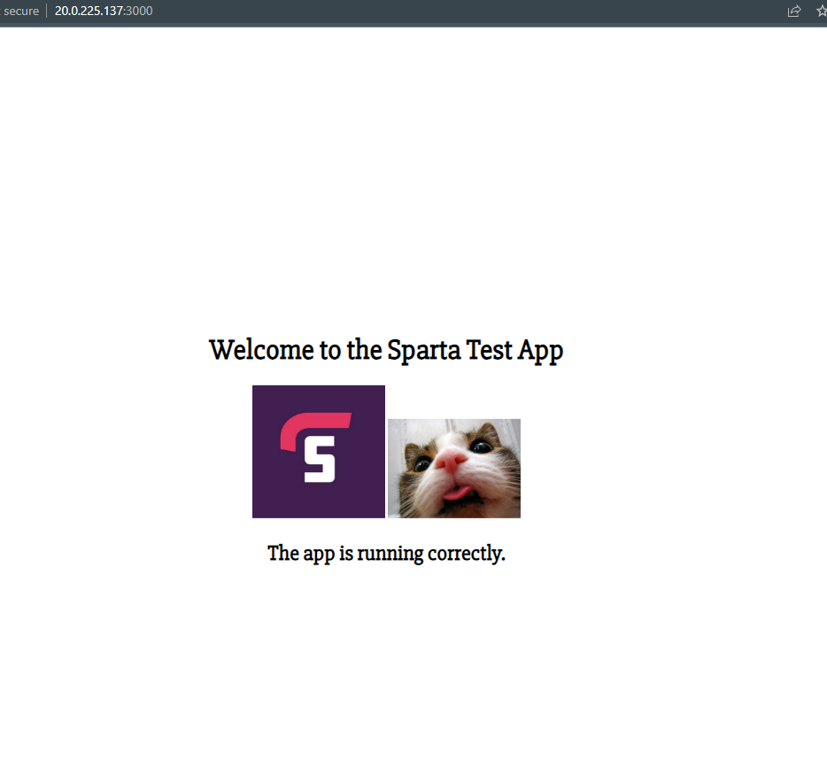
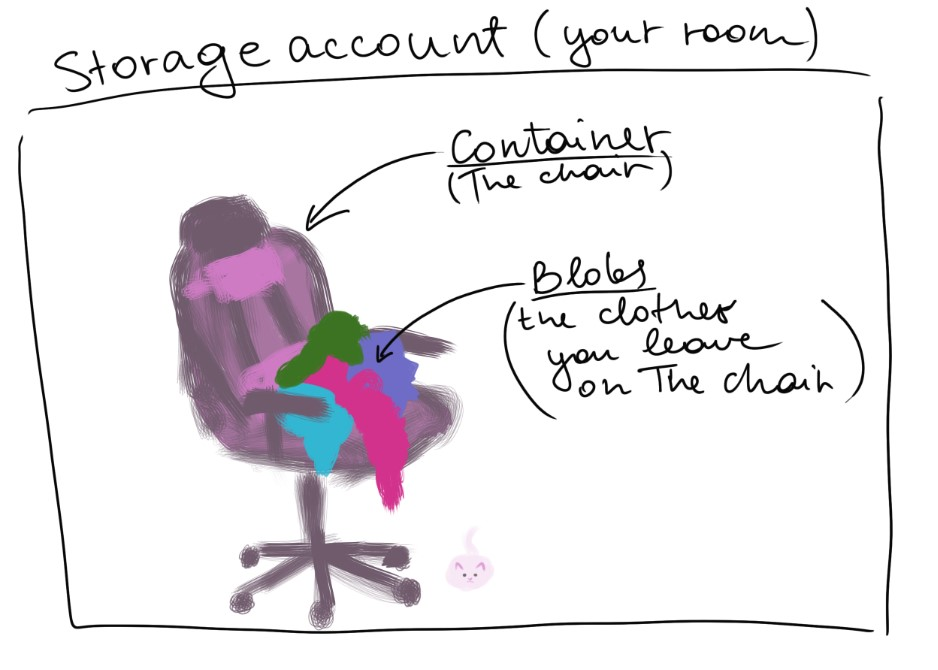

# Intro to Azure CLI


## Workingn in Azure CLI

```az login```

creating storage account 
```az storage account create --name tech241ivetastorage --resource-group tech241 --location uksouth --sku Standard_LRS```
sku is redundancy type


list all storage accounts
```az storage account list --resource-group tech241```


choose the bits you want to take from json
```az storage account list --resource-group tech241 --query "[].{Name:name, Location:location, Kind:kind}" --output table```

creating container. \ is to break commands up into lines (not necessary)
``` az storage container create \ --account-name tech241ivetastorage \ --name testcontainer ```


uploading file we created
``` az storage blob upload --account-name tech241ivetastorage --container-name testcontainer --name newname.txt --file test.txt --auth-mode login ```

check blobs in container
``` az storage blob list --account-name tech241ivetastorage --container-name testcontainer  --output table --auth-mode login ```


## Uploading image blob to account container

1. creating storage account 
```az storage account create --name tech241ivetastorage --resource-group tech241 --location uksouth --sku Standard_LRS```
2. creating container
``` az storage container create \ --account-name tech241ivetastorage \ --name catcontainer ```
3. downloading cat file
```curl https://wallpapercave.com/wp/6G16E6x.jpg --output newcat.jpg```
4. uploading file we created
``` az storage blob upload --account-name tech241ivetastorage --container-name catcontainer --name uploadedcat.txt --file newcat.txt --auth-mode login ```
5. modify HTML




## Blob storage



### What is blob storage?
Azure Blob Storage is Microsoft's object storage solution for the cloud. Blob Storage is optimized for storing massive amounts of unstructured data. Unstructured data is data that doesn't adhere to a particular data model or definition, such as text or binary data.

### Difference bertween blob storage and Azure file storage

Azure File Storage and Blob Storage offer the same level of redundancy, but Azure Blob Storage is cheaper than File Storage. Azure File Storage provides the folder for the data storage, while Azure Blob Storage does not provide the folder. 


### Advantages/disadvanatges 

| Advanateges | Disadvanatges |
| ----------- | ----------- |
| BLOBs are a good option for adding large binary data files to a database and can be easily referenced | Not all databases permit the use of BLOBs |
| It is easy to set access rights using rights management | 	BLOBs are inefficient due to the amount of disk space required and access time |
|Database backups or dumps contain all the data|Creating backups is highly time consuming due to the file size of BLOBs|


### Different blob tiers

- Hot Access tier - this tier should be used for the data frequently accessed by applications
- Cool Access tier - this storage tier is suitable for data that is not accessed frequently by applications and is expected to be stored for a minimum of 30 days
- Archive tier - this tier is intended to be used to store rarely accessed or archival data


## Types of redundancy

By default, Azure Storage replicates data three times within a primary region. Additionally, Azure offers the following options you can configure for replication within the primary region:

**Locally redundant storage (LRS)**—synchronously replicates data to three disks within a data center in the primary region. Offers a moderate level of availability at a lower cost.

**Zone-redundant storage (ZRS)**—synchronously replicates data amongthree Azure availability zones in the primary region. Provides a higher level of resilience at higher cost.


Beyond these two basic types of replication, there are three additional types available in Azure Storage:

**Geo-Redundant storage (GRS)**—stores another three copies of data in a paired Azure region

**Read-Access Geo-Redundant (RA-GRS)**—same as GRS, but allows data to be read from both Azure regions